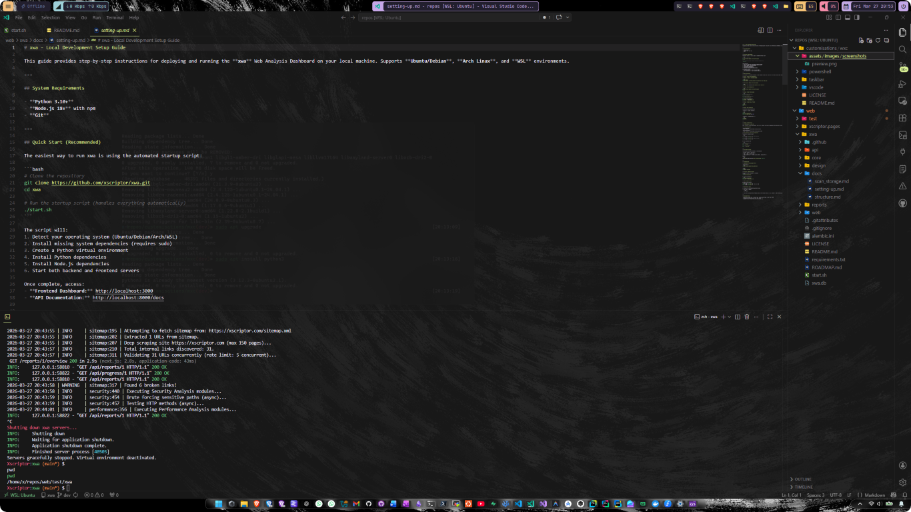

<h1 align="center">Windows X Customization</h1>

> Under active development

Customizations and utilities to improve accesibility and productivity in your own system

    

<em>Quick question</em>

  

<em>Do you want to improve the appearance of your Windows and make it more accessible?<em>

<h2 align="center">Tree</h2>

- Windows taskbar customization:
    - **[Taskbar](./taskbar/README.md)**: Themes used in the taskbar using **[Windhawk](https://github.com/ramensoftware/windhawk)**.

- Terminal - Powershell:
    - **[Powershell](./powershell/README..md)** To see some previews about the Windows terminal customization. To apply the customizations follow this link: **[XTerminal-Repo-Powershell](https://github.com/xscriptor/terminal/tree/main/powershell)**

- Visual Studio Code & forks:
    - Themes
        - **[Xscriptor-Themes](https://github.com/xscriptor/vscode/tree/main/themes/xscriptor-themes)**: daily use main themes.
        
        - **[X-Dark-Colors](https://github.com/xscriptor/vscode/tree/main/themes/x-dark-colors)**: occasional themes.

    - Extensions:
        - **[XGlass](https://github.com/xscriptor/vscode/tree/main/extensions/xglass)**: Make your vscode looks like glass.

*Pd:* here you'll find all the documentation but if you just want to look a preview and see if apply after [XVSCode](./vscode/README.md), to enjoy this fast just download this from extensions store.