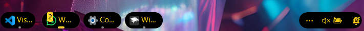
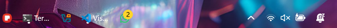
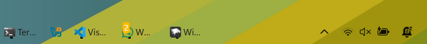
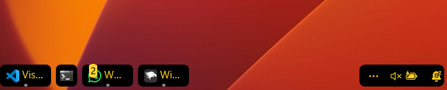

<h1>WXC Taskbar Customizations</h1>
<h2>Modern Windows taskbar styles with Windhawk</h2>

<h3><a href="xdark/README.md">xdark</a></h3>

A dark, minimalistic theme for sleek environments.

<h3><a href="xtranslucid/README.md">xtranslucid</a></h3>

A translucent acrylic theme with centered icons and a subtle gold border for a clean, modern look.

<h3><a href="xtranslucid-light/README.md">xtranslucid-light</a></h3>

A translucent acrylic theme with centered icons and a subtle gold border for a clean, modern light mode look.

<h3><a href="xblackgold/README.md">xblackgold</a></h3>

A dark, elegant black-and-gold theme for a premium look.

<h3><a href="xdeepocean/README.md">xdeepocean</a></h3>

Inspired by deep ocean tones, offering a cool and calm appearance.

<h3><a href="xgold/README.md">xgold</a></h3>

A bold and shiny golden theme for a luxurious look.

<h3><a href="xgrapepurple/README.md">xgrapepurple</a></h3>

A modern grape-inspired style with vibrant personality.

<h3><a href="xicegray/README.md">xicegray</a></h3>

A clean and soft icy gray theme for clarity and neutrality.

<h2>Features</h2>

Custom corner radius and padding 
Transparent and acrylic backgrounds 
Theme-aware foreground (text and icons) 
Focus on readability and elegance 
Lightweight modifications that respect system UX

<h2>How to Use</h2>

1. Make sure <a href="https://windhawk.net/">Windhawk</a> is installed on your system. 
2. Copy any of the <code>.json</code> files into Windhawk's <strong>Notification Center Styler</strong> or <strong>Taskbar Styler</strong> module. 
3. Apply the style from Windhawk's configuration interface. 
4. Restart Explorer (if necessary) for the changes to take full effect.

